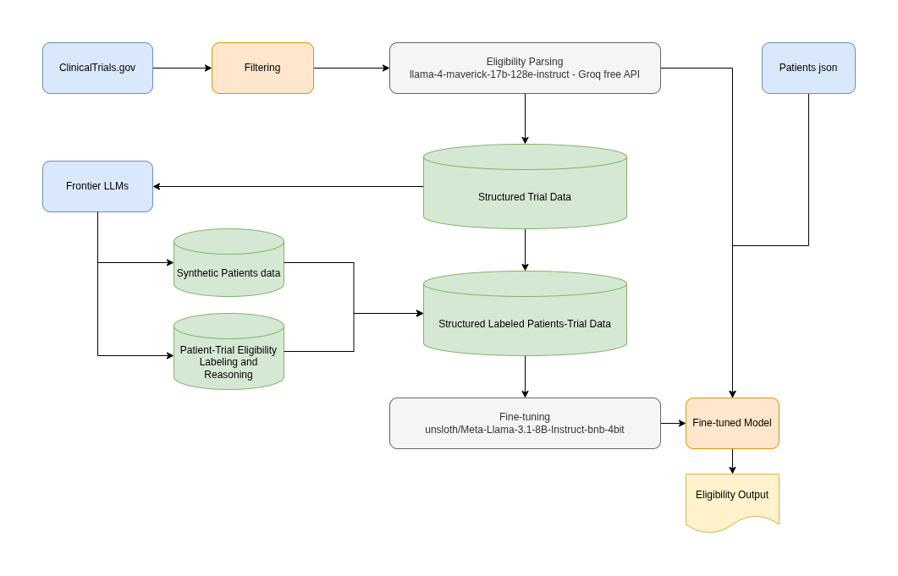

# Clinical Trial Eligibility Parsing & Patient-Trial Matching System

This project provides an end-to-end pipeline for extracting clinical trial data, structuring eligibility criteria, and evaluating patient eligibility using a fine-tuned language model. It integrates data engineering, schema-guided NLP parsing, and supervised LLM training to create a reproducible workflow suitable for healthcare AI applications.

# Overview

Clinical trial eligibility criteria are often written in long, unstructured text. This makes automated patient-trial matching difficult.<br>
The goal of this project is to:<br>

Collect and filter lung cancer clinical trials<br>
Parse trial eligibility criteria into a structured schema<br>
Normalize key clinical concepts<br>
Fine-tune an LLM to evaluate patient eligibility<br>
Provide a clean inference interface for real-world use<br>

The result is a modular system that transforms raw trial data into structured inputs suitable for machine learning and then uses a trained model to provide eligibility assessments.<br>

# Key Components

<h3> 1. Clinical Trial Data Ingestion </h3>

Pulls studies from the ClinicalTrials.gov API<br>
Filters for lung cancer–related trials using Mesh terms and additional rule-based heuristics<br>
Removes non-interventional and non-drug studies<br>
Consolidates eligibility text into a consistent format<br>

Strength: Creates a domain-specific, high-quality dataset suitable for downstream NLP tasks.<br>
For a full example see the [Parsing Results Sample](./assets/Parsing_Results_Sample.md).

<h3> 2. Eligibility Criteria Parsing (LLM-Based) </h3>

Uses a structured JSON schema to extract inclusion and exclusion criteria<br>
Captures ECOG status, lab thresholds, prior therapies, biomarkers, and other clinically relevant attributes<br>
Includes schema validation, error correction, and normalization steps<br>
Resolves common inconsistencies in eligibility phrasing<br>

Strength: Converts unstructured medical text into standardized, machine-readable data.

<h3> 3. Normalization & Clinical Logic </h3>

Normalizes ECOG ranges<br>
Maps ambiguous lab criteria to standard thresholds when possible<br>
Applies consistent terminology for metastases, prior treatments, and contraindications<br>
Flags unsupported or unclear criteria for review<br>

Strength: Improves data consistency and enables reliable comparisons across trials.

<h3> 4. Fine-Tuned Patient-Trial Matching Model </h3>

Creates supervised training pairs combining:<br>
Patient JSON profiles<br>
Parsed trial eligibility JSON<br>
Expected eligibility outcome and reasoning<br>
Trains a LoRA-based LLM using Unsloth<br>
Exports both adapter and merged model versions<br>
Includes an inference wrapper for production-style evaluation<br>

Strength: Provides a reproducible method for generating patient-trial eligibility decisions.

<h3> 5. Reproducible Pipeline & Modular Codebase </h3>

Separate modules for ingestion, parsing, validation, training, and inference<br>
Consistent data structures across all stages<br>
Test cases for key components<br>
Clear separation of concerns and extensible design<br>

Strength: Easy to extend to new disease areas, additional criteria, or alternative models.


# Architecture Diagram




# Training Behavior and Experiments

Early training experiments showed:

160 training steps → severe overfitting<br>
The validation set was not useful because of its small size (~60 evaluation examples)<br>

40 steps → good classification on ineligible cases but weak on eligible cases no validation set used<br>
This outcome was clearly caused by imbalance in the dataset where eligible patient examples represented only about 30%.<br>
Additional 5 eligible patients per trial were generated , increasing dataset size by ~50% reaching 900 examples<br>

Given the narrow experimentation window and the compute constraints of Google Colab free-tier GPU, the final training configuration I selected based on the information available:<br>

<b> 90 total training steps on the full dataset </b>


# Synthetic Patient Strategy

To reduce token consumption and make synthetic data generation consistent across multiple LLMs, each trial is assigned a fixed set of 10 base patient IDs (p001–p010).<br>
A unique patient identity is produced by combining:<br>
<b>trial_id + patient_id</b> 

<h3>This guarantees:</h3>

- Stable patient structure across models
- No ID collisions when using multiple LLMs
- Scalable synthetic generation without coordination between models
- Removes the need for the model to give me the entire eligibiltiy json for each synthetic patient in the generated CSV instead it pass the trial id which allows me to join the json later significantly lowers cost.

<h3>Lack of Human-in-the-Loop and Use of LLMs</h3>

Accurate clinical eligibility annotation requires medical expertise.<br>
Because human annotation is not feasible in this project, LLMs act as the sole annotation mechanism, including:

- Synthetic patient generation
- Eligibility labeling (is_eligible, reasoning)


<h3>Domain Scope</h3>

The system is currently focused on:

<b>"Therapeutic Interventional Lung-related cancer trials"</b>

This narrow scope improves schema consistency and training stability.<br>
The same framework can be extended to other cancer types or trial categories with moderate adjustments.


# Dataset Quality and Scale Considerations

The project prioritizes data quality over data quantity.
The current dataset contains 900 examples

Meaningful medical performance typically emerges at larger scales.
If the dataset were expanded to ~20,000 high-quality examples, the model would likely reach significantly stronger real-world usefulness below are few possible use cases:

Building automated pre-screening tools<br>
Creating structured trial datasets for research<br>
Analyzing eligibility patterns across trials<br>
Developing clinical decision support prototypes

# Future Extensions
Adding patient data parser<br>
Expansion beyond lung cancer<br>
Improved rule-based validation for ambiguous criteria<br>
Optional UI for trial exploration and matching


# Tech Stack

<b>Python</b> — Core language for data processing, model training, and orchestration<br>
<b>Google Colab</b> — Training and experimentation environment under free GPU constraints<br>
<b>Hugging Face</b> — Model hosting, dataset management, and inference utilities<br>
<b>Unsloth</b> — Efficient fine-tuning workflow optimized for low-resource hardware<br>
<b>LoRA</b> — Parameter-efficient training method used to adapt the base LLM<br>
<b>LLM models</b>:<br>
<b>- unsloth/Meta-Llama-3.1-8B-Instruct-bnb-4bit</b> — finetuned for patient-trial matching and reasoning<br>
<b>- meta-llama/llama-4-maverick-17b-128e-instruct - Groq free API</b> — Eligibility text–to–JSON parsing<br>
<b>Grok, ChatGPT, DeepSeek, and Gemini</b> — Synthetic patient generation, eligibility labeling, and reasoning


# Quick Start (Colab)

“This project is designed to run in a Google Colab environment with GPU access. Local setup has not been tested and may require adjustments.”

The exact installation commands used in the notebooks are:
```python
!pip install -q "unsloth[colab-new] @ git+https://github.com/unslothai/unsloth.git"
!pip install -q --no-deps xformers==0.0.28 trl peft accelerate bitsandbytes
!pip install -q huggingface_hub transformers sentencepiece
```

Clone the repository

* git clone https://github.com/Ayham-0010/(repo name)
cd repo name

Open the notebooks: 

1. Parsing.ipynb
* Get your Groq API key for eligibility parsing
* Run the notebook

2. Inference.ipynb
* Get your Hugging Face token with read permissions
* Get your Groq API key for eligibility parsing
* load the model
* Set the input (patient and trial eligibiliity)
* Run the inferance function


<br>
<br>
<b>Disclaimer</b>: This project is a proof of concept and is not suitable for use in real medical decision-making or clinical scenarios.